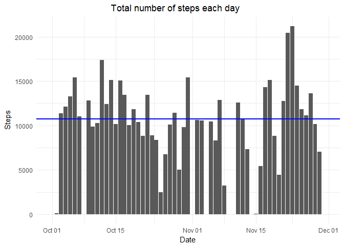
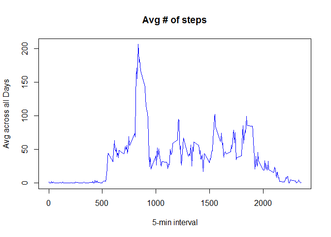

```r
library(ggplot2)
#library(dplyr)
library(plyr)
#library(statsr)
library(data.table)
#library(ggplot2)
#library(grid)
#library(gridExtra)
#library(knitr)
#library(kableExtra)
#library(tidyverse)
library(lubridate)
```

## Loading and preprocessing the data


```r
# set working & create data directory
setwd("C:\\Users\\dabradford\\Desktop\\Coursera\\DataSci\\Reproducible\\RepData_PeerAssessment1")
if(!file.exists("./data")){dir.create("./data")}

# download activity monitoring data
get.data.project <- "https://d396qusza40orc.cloudfront.net/repdata%2Fdata%2Factivity.zip"
download.file(get.data.project,destfile="./data/activity_monitoring_data.zip",method="auto")

zipfile.data = "activity_monitoring_data.zip"

# make sure the data is in the working directory if not download the zip file into the to zipfile.data and unzip it
if(!file.exists(zipfile.data)) {        
    unzip(zipfile="./data/activity_monitoring_data.zip",exdir="./data")
} 

path_act <- file.path("./data" , "./data/activity_monitoring_data")
files<-list.files(path_act, recursive=TRUE)

# Read data file
activity <- data.table::fread("./data/activity.csv")

activity$date <- as.Date(activity$date, "%Y-%m-%d")

# inspect data file
#str(activity)
#head(activity)
```


## What is mean total number of steps taken per day?


```r
options(scipen=999)
steps_per_day <- ddply(activity, ~date, summarise, steps=sum(steps, na.rm = TRUE))

mean_steps = round(mean(steps_per_day$steps[steps_per_day$steps != 0]), 0)
median_steps = round(median(steps_per_day$steps[steps_per_day$steps != 0]), 0)

plot1 <- ggplot(steps_per_day, aes(x=date, y=steps)) + 
    geom_bar(stat="identity") +
    labs(x="Date", y="Steps", title="                             Total number of steps each day") +
    theme_minimal() +
    geom_hline(yintercept = round(mean(steps_per_day$steps[steps_per_day$steps != 0]), 0), col='blue',size=1)

plot1
```

<!-- -->


### The mean number of steps taken per day (excluding days with no steps) is 10766. The median number of steps is 10765.


## What is the average daily activity pattern?


```r
time_series <- tapply(activity$steps, activity$interval, mean, na.rm = TRUE)

plot(row.names(time_series), time_series, type = "l", xlab = "5-min interval", 
    ylab = "Avg across all Days", main = "Avg # of steps",
    col = "blue")
```

<!-- -->

```r
max_interval <- names(which.max(time_series))
```

### The 5-minute interval across all the days in the dataset that, on average, contains the maximum number of steps is the 835 interval.


## Imputing missing values


## Are there differences in activity patterns between weekdays and weekends?

