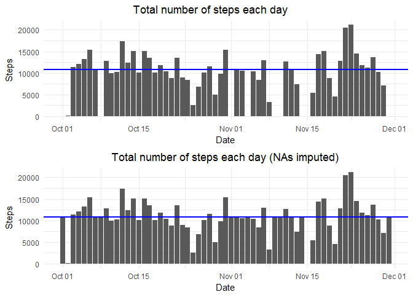
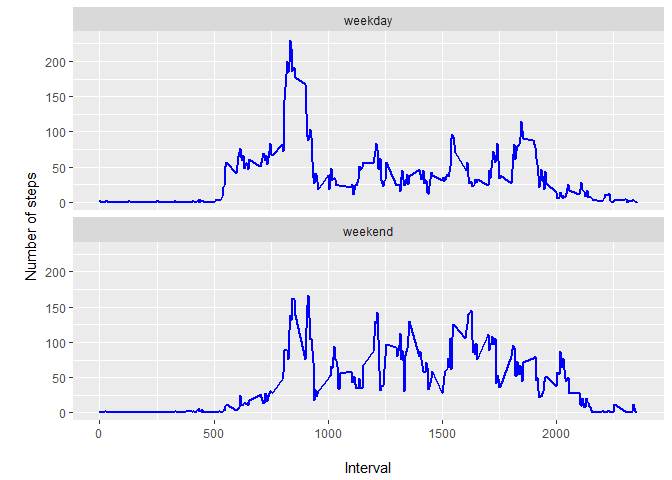

```r
library(ggplot2)
library(dplyr)
library(plyr)
library(data.table)
library(grid)
library(gridExtra)
library(lubridate)
```

## Loading and preprocessing the data


```r
# set working & create data directory
setwd("C:\\Users\\dabradford\\Desktop\\Coursera\\DataSci\\Reproducible\\RepData_PeerAssessment1")
if(!file.exists("./data")){dir.create("./data")}

# download activity monitoring data
get.data.project <- "https://d396qusza40orc.cloudfront.net/repdata%2Fdata%2Factivity.zip"
download.file(get.data.project,destfile="./data/activity_monitoring_data.zip",method="auto")

zipfile.data = "activity_monitoring_data.zip"

# make sure the data is in the working directory if not download the zip file into the to zipfile.data and unzip it
if(!file.exists(zipfile.data)) {        
    unzip(zipfile="./data/activity_monitoring_data.zip",exdir="./data")
} 

path_act <- file.path("./data" , "./data/activity_monitoring_data")
files<-list.files(path_act, recursive=TRUE)

# Read data file
activity <- data.table::fread("./data/activity.csv")

activity$date <- as.Date(activity$date, "%Y-%m-%d")

# inspect data file
#str(activity)
#head(activity)
```


## What is mean total number of steps taken per day?


```r
options(scipen=999)
steps_per_day <- ddply(activity, ~date, summarise, steps=sum(steps, na.rm = TRUE))

mean_steps = round(mean(steps_per_day$steps[steps_per_day$steps != 0]), 0)
median_steps = round(median(steps_per_day$steps[steps_per_day$steps != 0]), 0)

plot1 <- ggplot(steps_per_day, aes(x=date, y=steps)) + 
    geom_bar(stat="identity") +
    labs(x="Date", y="Steps", title="                             Total number of steps each day") +
    theme_minimal() +
    geom_hline(yintercept = round(mean(steps_per_day$steps[steps_per_day$steps != 0]), 0), col='blue',size=1)

plot1
```

<!-- -->


### The mean number of steps taken per day (excluding days with no steps) is __10766__. The median number of steps is __10765__.


## What is the average daily activity pattern?


```r
time_series <- tapply(activity$steps, activity$interval, mean, na.rm = TRUE)

plot(row.names(time_series), time_series, type = "l", xlab = "5-min interval", 
    ylab = "Avg across all Days", main = "Avg # of steps",
    col = "blue")
```

<!-- -->

```r
max_interval <- names(which.max(time_series))
```

### The 5-minute interval across all the days in the dataset that, on average, contains the maximum number of steps is the __835__ interval.


## Imputing missing values

Ok so I went ahead and answered question 1 accounting for missing values.  But for that question I ignored any observation with a 'NA'.  Now I want to fill in those NAs with an alternate value that make sense but don't introduce any further bias in  the data.

First, how many NAs are in the data set?


```r
summary(activity)
```

```
##      steps             date               interval     
##  Min.   :  0.00   Min.   :2012-10-01   Min.   :   0.0  
##  1st Qu.:  0.00   1st Qu.:2012-10-16   1st Qu.: 588.8  
##  Median :  0.00   Median :2012-10-31   Median :1177.5  
##  Mean   : 37.38   Mean   :2012-10-31   Mean   :1177.5  
##  3rd Qu.: 12.00   3rd Qu.:2012-11-15   3rd Qu.:1766.2  
##  Max.   :806.00   Max.   :2012-11-30   Max.   :2355.0  
##  NA's   :2304
```

We have 2,304 NAs in the 'steps' variable.

We were given two options to fill in the missing data:

1.  Use the mean/median for that day, or
2.  Use the mean for that 5-minute interval

I think using the mean for the 5-minute interval makes the most sense so I will create a new data set but with missing data filled in:


```r
new_steps_per_day <- activity

na_steps <- is.na(new_steps_per_day$steps)

mean_interval <- tapply(new_steps_per_day$steps, new_steps_per_day$interval, mean, na.rm=TRUE)

new_steps_per_day$steps[na_steps] <- mean_interval[as.character(new_steps_per_day$interval[na_steps])]

summary(new_steps_per_day)
```

```
##      steps             date               interval     
##  Min.   :  0.00   Min.   :2012-10-01   Min.   :   0.0  
##  1st Qu.:  0.00   1st Qu.:2012-10-16   1st Qu.: 588.8  
##  Median :  0.00   Median :2012-10-31   Median :1177.5  
##  Mean   : 37.38   Mean   :2012-10-31   Mean   :1177.5  
##  3rd Qu.: 27.00   3rd Qu.:2012-11-15   3rd Qu.:1766.2  
##  Max.   :806.00   Max.   :2012-11-30   Max.   :2355.0
```

So, no more NAs in the dataset, yay!  Now let's plot a histogram and compare to my original findings in question 1:


```r
options(scipen=999)
grp_steps_per_day <- ddply(new_steps_per_day, ~date, summarise, steps=sum(steps, na.rm = TRUE))

mean_steps_new = round(mean(grp_steps_per_day$steps))
median_steps_new = round(median(grp_steps_per_day$steps))

plot2 <- ggplot(grp_steps_per_day, aes(x=date, y=steps)) + 
    geom_bar(stat="identity") +
    labs(x="Date", y="Steps", title="                      Total number of steps each day (NAs imputed)") +
    theme_minimal() +
    geom_hline(yintercept = mean_steps, col='blue',size=1)

grid.arrange(plot1, plot2, ncol = 1)
```

<!-- -->

### In the original data, the mean number of steps taken per day (excluding days with no steps) was __10766__. The median number of steps was __10765__.  In the new data set, with missing values imputed, the mean number of steps taken per day is unchanged at __10766__.  The median number of steps is increased by 1 to __10766__.

Given my approach in filling in the missing data by averaging out adjacent intervals it makes sense that the mean and median numbers are unchanged.


## Are there differences in activity patterns between weekdays and weekends?

First I'll create a new factor variable in the new dataset with two levels:  "weekday" and "weekend".


```r
#create vector with "Saturday" and "Sunday"
weekend_days <- weekdays(Sys.Date()+2:3)

new_steps_per_day <- mutate(new_steps_per_day, day.type = ifelse(weekdays(new_steps_per_day$date+0) %in% weekend_days, "weekend", "weekday"))
```

And then plot the two categorical variables


```r
weekday <- aggregate(steps ~ interval + day.type, data = new_steps_per_day, FUN = mean, na.rm = TRUE)

ggplot(weekday, aes(x=interval, y=steps)) + 
  geom_line(color="blue", size=1) + 
  facet_wrap(~day.type, nrow=2) +
  labs(x="\nInterval", y="\nNumber of steps")
```

<!-- -->

